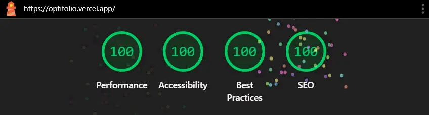

# OptiFolio - Modern Developer Portfolio Template

OptiFolio is a high-performance, modern portfolio template for developers, built with [Eleventy (11ty)](https://www.11ty.dev/). It features a sleek dark theme, mobile-first responsive design, and CSS-only animations for a delightful user experience.

---

> **If you like this project, please ⭐ star and fork the repository to support its development!**  

---

## ✨ Features

- **Perfect Lighthouse scores** (100/100)

- **Sleek dark theme** with purple accents
- **Mobile-first** responsive layout
- **CSS-only** animations and interactions
- **Semantic HTML5** and accessible markup
- **Minimal vanilla JS** (only 2.6KB)
- **Easy content customization** via Nunjucks templates

> **Customization:**  
> To enable, disable, or tweak features, modify the relevant partials under `src/_includes/partials/`. For example, to switch color accents or adjust performance features, edit `src/styles/style.css` or the animation code in HTML/CSS partials.

## 🚀 Quick Start

```bash
# 1. Clone repository
git clone https://github.com/pranav89624/OptiFolio.git
cd OptiFolio

# 2. Install dependencies
npm install

# 3. Start development server
npm run start

# 4. Build for production
npm run build
```

> **Customization:**  
> Use your own repository link in the `git clone` step.  
> If you wish to deploy to a different output directory, adjust the `output` in `.eleventy.js`.  
> You can add custom npm scripts in your `package.json` for additional workflows.

## 🏗 Project Structure

```
src/
├── _includes/
│   ├── layouts/
│   │   └── base.njk          # Main template
│   └── partials/             # Component library
│       ├── header.njk        # Navigation bar
│       ├── hero.njk          # Introduction section  
│       ├── skills.njk        # Skills matrix
│       ├── projects.njk      # Work showcase
│       ├── testimonials.njk  # Client feedback
│       ├── cta.njk           # Contact CTA
│       └── footer.njk        # Footer content
├── styles/
│   └── style.css             # Global stylesheet
├── index.njk                 # Homepage content
.eleventy.js                  # 11ty configuration
```

> **Customization:**  
> - Add, remove, or rename sections by editing, duplicating, or deleting partials in `src/_includes/partials/`.  
> - To reorganize the site structure, modify `base.njk` and update navigation in `header.njk`.  
> - Add global styles or new CSS files in `src/styles/`.  
> - Place your favicon or other static assets in the appropriate directory and update HTML references.

## 🎨 Customization Guide

### Personalize Content

Edit the hero section with your name and tagline:
```html
<!-- src/_includes/partials/hero.njk -->
<h1 class="hero-title">Your Name Here</h1>
<p class="hero-subtitle">Your professional tagline</p>
```
> **Customization:**  
> Change the text, add images, or insert extra markup for social links or call-to-action buttons as needed.

### Modify Design

Tweak theme colors and fonts in `src/styles/style.css`:
```css
:root {
  --color-primary: #6366f1;
  --color-dark: #0f172a;
  --color-light: #f8fafc;
  --font-base: 'Inter', sans-serif;
  --font-mono: 'Space Mono', monospace;
}
```
> **Customization:**  
> Adjust the hex values for your brand, import your own fonts, or add new CSS variables for additional theming.

### Add Projects

Add project cards in `src/_includes/partials/projects.njk`:
```html
<article class="project-card">
  <div class="project-image">
    
  </div>
  <div class="project-content">
    <h3>Project Title</h3>
    <p>Project description...</p>
    <ul class="project-tech">
      <li>React</li>
      <li>Node.js</li>
    </ul>
  </div>
</article>
```
> **Customization:**  
> Duplicate the `<article>` block for more projects, update image sources, edit descriptions, and list relevant technologies.  
> You can also add new fields or links (e.g., demo, case study) as needed.

---

## ⚡ Performance Optimizations

| Technique         | Implementation Details                   |
|-------------------|------------------------------------------|
| Critical CSS      | Inlined in base template (`base.njk`)    |
| Image Loading     | Native lazy loading (`loading="lazy"`)   |
| Font Handling     | Preload in `<head>` with `crossorigin`   |
| JavaScript        | Minimal, inlined in `base.njk`           |
| Animations        | Hardware-accelerated CSS transforms      |

> **Customization:**  
> - To add or remove optimizations, tweak the `<head>` section in your layout, the CSS in `styles/`, or the minimal JS at the bottom of `base.njk`.  
> - Replace or add font providers, change preload strategies, or use your own image CDN.

---

## 🤝 Section-by-Section Customization

### Header & Navigation

- Edit `src/_includes/partials/header.njk` to update nav links.  
- To add a new section, create a new partial and add a link in this file.

### Skills

- Update your skills in `skills.njk` by editing the list items or adding/removing cards.

### Education

- Add your degrees and certifications by editing or duplicating the `<article>` blocks in the education section partial.

### Projects

- See above in "Add Projects" for details.

### Testimonials

- Edit `testimonials.njk` to add, update, or remove testimonials.  
- Each testimonial is a `<blockquote class="testimonial-card">` block.

### Call to Action (CTA)

- Update your contact details or call-to-action text in `cta.njk`.  
- Add direct email, social links, or forms as needed.

### Footer

- Edit `footer.njk` for copyright, attribution, and additional links.

---

## 🚀 Deployment

### Netlify
1. [Sign up](https://app.netlify.com/signup) and connect your GitHub account.
2. Click **New Site from Git** and select your OptiFolio repository.
3. Set build command: `npm run build`
4. Set output directory: `_site`
5. Click **Deploy Site**.

### Vercel
1. [Sign up](https://vercel.com/signup) and import your repo.
2. Set build command: `npm run build`
3. Set output directory: `_site`
4. Click **Deploy**.

### GitHub Pages
- Not recommended for 11ty-based dynamic sites, but possible with some workarounds.

#### Live Demo
[View OptiFolio Live](https://optifolio.vercel.app)

#### Troubleshooting
- If you see a blank page, check the output directory and asset paths.
- Review the deploy logs for missing dependencies or build errors.

---

## 🛠 Tech Stack

- **[Eleventy (11ty)](https://www.11ty.dev/)**: A fast, modern static site generator.
- **[Nunjucks](https://mozilla.github.io/nunjucks/)**: A powerful templating engine for HTML.
- **CSS**: Custom styles with variables, responsive design, and animations.
- **[Vanilla JS](https://developer.mozilla.org/en-US/docs/Web/JavaScript)**: Minimal JavaScript for interactions.

> Learn more about static site generators and CSS animations through [11ty resources](https://www.11ty.dev/docs/) and [CSS Tricks](https://css-tricks.com/).

---

## ♿ Accessibility Statement

OptiFolio is designed with accessibility in mind:
- Semantic HTML5 ensures screen readers can parse content effectively.
- ARIA roles are applied where necessary for better navigation.
- High contrast colors are used for readability.

### Tips for Customization:
- Maintain sufficient color contrast when changing theme colors.
- Test your site’s accessibility using tools like [Lighthouse](https://developers.google.com/web/tools/lighthouse) or [axe](https://www.deque.com/axe/).
- Ensure all interactive elements (e.g., buttons, links) are keyboard-navigable.

---

- 🛠 Built with Eleventy by [Pranav](https://github.com/pranav89624)
- 🎨 Designed for developers
- 📱 Fully responsive on all devices

---